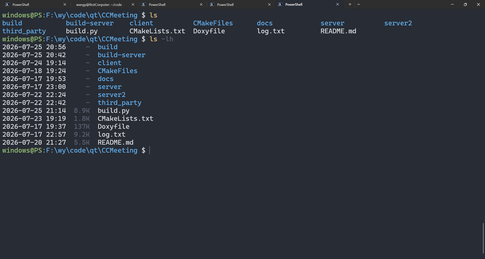

# Using_UNIX_commands_in_powershell

在 Windows PowerShell 中使用接近 Linux / Ubuntu 习惯的常用命令与终端体验。


本项目通过模块化脚本（入口 `src/load.ps1` / `Using_UNIX_commands_in_powershell.ps1`）提供：

- Linux 风格的 `ls` / `ll`（彩色、横向多列、长列表、可读大小；管道时输出文件名）
- Linux 风格的 `find`（支持管道输入路径、管道输出完整路径）
- 文本工具：`grep`、`cat`、`head`、`tail`、`wc`、`tee`、`sort`、`uniq`、`diff`
- 路径工具：`basename`、`dirname`、`tree`
- 磁盘与链接：`du`、`df`、`ln`
- 其他：`which`、`clear`
- 常用文件命令：`pwd`、`mkdir`、`touch`、`rm`、`cp`、`mv`
- 类似 `user@host:path $` 的彩色提示符
- `build.ps1` 安装 / `remove.ps1` 卸载

命令参数与行为尽量贴近 GNU/Linux 常见用法（支持 `-al`、`-rf` 等组合短选项）。完整命令说明见 [COMMANDS.md](COMMANDS.md)。

## 环境要求

- Windows 10 / 11
- Windows PowerShell 5.1，或 PowerShell 7+
- 建议使用支持 ANSI 真彩色的终端（Windows Terminal、新版 PowerShell 控制台）

## 快速开始

### 1. 获取脚本

将仓库克隆或下载到本地，例如：

```powershell
git clone <你的仓库地址>
cd Using_UNIX_commands_in_powershell
```

### 2. 永久安装（推荐：运行 build.ps1）

在仓库根目录执行：

```powershell
.\build.ps1
```

`build.ps1` 会自动完成：

1. 将 `src\` 复制到 `$PROFILE` 同级目录下的 `Using_UNIX_commands_in_powershell\`
2. 在 `$PROFILE` 中写入（或更新）受标记保护的加载块
3. 若本机尚无 `$PROFILE` 文件，会**自动创建**，并在终端用醒目颜色提示
4. 若仍存在旧版 `windows_use_linux_order` 标记块/安装目录，会一并清理

安装完成后，**重新打开**一个 PowerShell 窗口即可生效。当前会话也可立即加载：

```powershell
. "$([IO.Path]::Combine((Split-Path $PROFILE -Parent), 'Using_UNIX_commands_in_powershell', 'load.ps1'))"
```

再次运行 `.\build.ps1` 可覆盖安装目录并刷新 `$PROFILE` 中的加载块。

### 3. 临时手动加载（当前会话）

不写配置、只在当前窗口试用时，在仓库根目录执行：

```powershell
. .\src\load.ps1
```

或使用兼容入口：

```powershell
. .\Using_UNIX_commands_in_powershell.ps1
```

注意前面的点号 `.`（点源加载），这样函数和别名才会进入当前会话。

加载成功后可直接试用：

```powershell
ls
ll
pwd
find . -name "*.ps1"
ls | grep Color
cat -n .\README.md
find . -type f -name "*.ps1" | grep grep
head -n 5 .\README.md
cat .\README.md | tail -n 3
wc -l .\README.md
Get-Content .\README.md | sort | uniq | head -n 5
basename .\src\cat\cat.ps1
dirname .\src\cat\cat.ps1
tree -L 1 .\src
du -sh .\src
df -h
which ls
```

关闭该窗口后配置会失效。

### 4. 手动写入 $PROFILE（可选）

一般不必手写；优先使用上一节的 `build.ps1`。若你更想自己控制加载路径，可如下操作。

先查看当前配置文件路径：

```powershell
$PROFILE
```

常见路径类似：

```text
C:\Users\<用户名>\Documents\WindowsPowerShell\Microsoft.PowerShell_profile.ps1
```

或 PowerShell 7：

```text
C:\Users\<用户名>\Documents\PowerShell\Microsoft.PowerShell_profile.ps1
```

若文件不存在，可创建：

```powershell
if (!(Test-Path -Path $PROFILE)) {
    New-Item -ItemType File -Path $PROFILE -Force
}
notepad $PROFILE
```

在配置文件末尾添加一行（路径改成你的实际路径）：

```powershell
. "F:\wy\Using_UNIX_commands_in_powershell\src\load.ps1"
```

或：

```powershell
. "F:\wy\Using_UNIX_commands_in_powershell\Using_UNIX_commands_in_powershell.ps1"
```

保存后，**重新打开**一个 PowerShell 窗口即可自动生效。

也可一行追加：

```powershell
Add-Content -Path $PROFILE -Value '. "F:\wy\Using_UNIX_commands_in_powershell\src\load.ps1"'
```

### 5. 若提示“无法加载，因为在此系统上禁止运行脚本”

当前执行策略可能过严。可仅对当前用户放开（推荐）：

```powershell
Set-ExecutionPolicy -ExecutionPolicy RemoteSigned -Scope CurrentUser
```

然后重新打开 PowerShell，再运行 `.\build.ps1` 或点源加载脚本。

也可不改策略，仅对当前会话绕过：

```powershell
powershell -ExecutionPolicy Bypass -NoExit -File "F:\wy\Using_UNIX_commands_in_powershell\Using_UNIX_commands_in_powershell.ps1"
```

注意：`-File` 会在脚本结束后退出（除非加 `-NoExit`）；若希望函数留在交互会话里，仍建议用点源加载：

```powershell
powershell -NoExit -Command ". 'F:\wy\Using_UNIX_commands_in_powershell\src\load.ps1'"
```

## 验证是否生效

```powershell
Get-Command ls, ll, find, grep, cat, head, tail, wc, tee, sort, uniq, basename, dirname, tree, du, df, ln, diff, which, clear, mkdir, touch, rm, cp, mv, pwd
ls -alh
ll
find . -type f -name "*.ps1"
ls .\src\common | grep Color
cat -n .\README.md | Select-Object -First 5
head -n 3 .\README.md
wc -l .\README.md
tree -L 1 .\src
du -sh .
df -h
```

提示符应类似：

```text
windows@PS:F:\wy\Using_UNIX_commands_in_powershell $
```

（提示符中的用户名目前写死在脚本的 `prompt` 函数里，可按需自行修改。）

## 文档

| 文档 | 说明 |
|------|------|
| [COMMANDS.md](COMMANDS.md) | 本项目提供的全部命令、参数与示例 |

## 说明与限制

- 本项目是对常用 Linux 命令的**子集模拟**，并非完整 GNU coreutils / findutils。
- `find` 的 `-ctime` 在 Windows 上用创建时间近似（系统无 Unix 语义上的 ctime）。
- `ls` 颜色规则为简化版（目录 / 可执行脚本 / 压缩包 / 图片 / 其他）。
- `ls` 直接显示时为彩色多列；接入管道时输出文件名，便于 `ls | grep`。
- `ln -s` 在 Windows 上创建符号链接通常需要管理员权限或开启开发者模式。
- 部分命令会覆盖 PowerShell 自带别名（如 `ls`、`cat`、`mkdir`、`pwd`、`rm`、`cp`、`mv`、`sort`、`tee`、`clear`、`diff`）。若不需要，可卸载本项目。

## 卸载

推荐在仓库根目录执行：

```powershell
.\remove.ps1
```

`remove.ps1` 会：

1. 从 `$PROFILE` 删除 `# >>> Using_UNIX_commands_in_powershell BEGIN` … `# <<< Using_UNIX_commands_in_powershell END` 整段（旧版 `windows_use_linux_order` 标记也会清理）
2. 删除 `$PROFILE` 同级目录下的 `Using_UNIX_commands_in_powershell\` 安装文件夹（旧版目录一并删除）

仅清理配置、保留安装目录时：

```powershell
.\remove.ps1 -KeepInstallFolder
```

也可手动：从 `$PROFILE` 删除上述标记块，并删除安装目录；若是手动写入的一行加载语句，删掉该行即可。

保存后重新打开 PowerShell 生效。

## 许可证

若仓库未单独声明许可证，默认仅供个人学习与自用；二次分发请自行补充许可说明。
